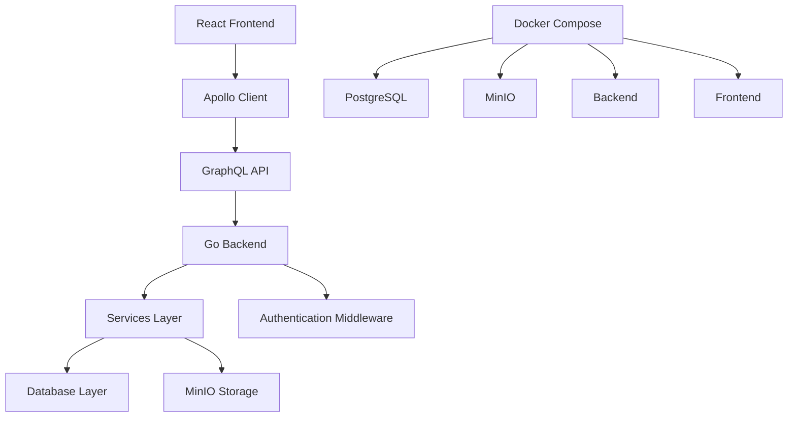

# Aegis File Vault - Architecture Documentation

## Overview

Aegis is a secure file vault application built with a modern full-stack architecture. It provides end-to-end encrypted file storage with collaborative features through rooms and folders. The application consists of a React/TypeScript frontend and a Go backend with GraphQL API.

## Architecture Overview



## Backend Architecture

### Technology Stack
- **Language**: Go 1.x
- **Framework**: Gin HTTP framework
- **API**: GraphQL with gqlgen
- **Database**: PostgreSQL with GORM
- **Storage**: MinIO (S3-compatible)
- **Authentication**: JWT tokens stored in HttpOnly cookies
- **Middleware**: CORS, Authentication

### Core Components

#### 1. Main Entry Point (`cmd/main.go`)
- Initializes configuration
- Sets up database connection
- Configures GraphQL server with gqlgen
- Sets up middleware (CORS, Auth)
- Starts HTTP server with graceful shutdown
- Serves GraphQL playground in development

#### 2. GraphQL Layer
- **Schema** (`graph/schema.graphql`): Defines types, queries, and mutations
- **Resolvers** (`graph/schema.resolvers.go`): Implements GraphQL operations
- **Generated Code**: Auto-generated types and interfaces

#### 3. Services Layer
Located in `internal/services/`:

- **FileService**: Handles file uploads, downloads, storage operations
- **UserService**: Manages user registration, authentication, quotas
- **RoomService**: Manages collaborative rooms and permissions
- **FolderService**: Handles hierarchical folder organization
- **AdminService**: Administrative operations and dashboard stats

#### 4. Models Layer (`internal/models/`)
Core data structures using GORM:

- **User**: User accounts with storage quotas
- **File**: Unique file content (by hash)
- **UserFile**: User's file metadata with encryption keys
- **Folder**: Hierarchical folder structure
- **Room**: Collaborative spaces
- **RoomMember**: Room membership with roles
- **RoomFile/RoomFolder**: Sharing relationships

#### 5. Database Layer (`internal/database/`)
- PostgreSQL connection with GORM
- Migration support (though currently disabled)
- Connection pooling and error handling

#### 6. Middleware (`internal/middleware/`)
- **AuthMiddleware**: JWT token validation
- **CORS**: Cross-origin request handling

### Authentication Flow
1. User registers/logs in via GraphQL mutations
2. Backend validates credentials
3. JWT token stored in HttpOnly cookie
4. Subsequent requests include cookie automatically
5. Middleware validates token on protected routes

### File Storage Architecture
1. Files uploaded via GraphQL mutations
2. Content hashed (SHA-256) for deduplication
3. Encrypted with user-specific keys
4. Stored in MinIO object storage
5. Metadata stored in PostgreSQL
6. Downloads decrypt on-the-fly

## Frontend Architecture

### Technology Stack
- **Language**: TypeScript
- **Framework**: React 18
- **Routing**: React Router v6
- **State Management**: Apollo Client (GraphQL) + React Context
- **UI Library**: Material-UI (MUI)
- **Build Tool**: Create React App
- **HTTP Client**: Apollo Client for GraphQL

### Core Components

#### 1. App Structure (`src/App.tsx`)
- Root component with routing setup
- Theme provider (Material-UI)
- Apollo provider for GraphQL
- Auth provider for authentication state
- Error boundary for error handling

#### 2. Routing
- **Public Routes**: `/login`, `/register`
- **Protected Routes**: `/dashboard`, `/admin`
- Route guards for authentication and admin access

#### 3. Apollo Client Setup (`src/apollo/client.ts`)
- HTTP link to backend GraphQL endpoint
- Authentication via HttpOnly cookies
- Error handling for auth failures
- In-memory cache for query results

#### 4. Authentication Context (`src/contexts/AuthContext.tsx`)
- Manages user authentication state
- GraphQL mutations for login/register/logout
- Token refresh functionality
- Loading states

#### 5. Component Structure
```
src/components/
├── auth/           # Login/Register forms
├── dashboard/      # Main dashboard layout
│   ├── Dashboard.tsx
│   ├── DashboardAppBar.tsx
│   ├── DashboardSidebar.tsx
│   └── StatsCards.tsx
├── common/         # Reusable components
│   ├── FileExplorer.tsx
│   ├── FileTable.tsx
│   ├── FileUploadDropzone.tsx
│   └── LoadingSpinner.tsx
└── admin/          # Admin-specific components
```

#### 6. Custom Hooks
- **useDashboardNavigation**: Navigation state management
- **useFileOperations**: File CRUD operations
- **useFileUpload**: Upload progress and handling
- **useUserMenu**: User menu interactions

### State Management
- **Apollo Client**: GraphQL query/mutation state
- **React Context**: Authentication state
- **Local Component State**: UI-specific state
- **Custom Hooks**: Encapsulated business logic

## Data Flow

### File Upload Flow
1. User selects file in frontend
2. File encrypted client-side with user key
3. GraphQL mutation `uploadFile` called
4. Backend validates user authentication
5. Checks storage quota
6. Calculates content hash for deduplication
7. Stores encrypted file in MinIO
8. Saves metadata in database
9. Returns file information

### File Download Flow
1. User requests file download
2. GraphQL query gets download URL
3. Backend validates access permissions
4. Generates presigned MinIO URL
5. Frontend downloads and decrypts file
6. File saved locally

### Authentication Flow
1. User submits login form
2. GraphQL mutation calls backend
3. Backend validates credentials
4. JWT token set in HttpOnly cookie
5. Frontend updates auth context
6. Protected routes become accessible

## Database Schema

### Core Tables
- **users**: User accounts and quotas
- **files**: Unique file content by hash
- **user_files**: User-specific file metadata
- **folders**: Hierarchical folder structure
- **rooms**: Collaborative spaces
- **room_members**: Room membership and roles
- **room_files**: File sharing in rooms
- **room_folders**: Folder sharing in rooms
- **download_logs**: Analytics tracking

### Relationships
- User → UserFile (1:many)
- UserFile → File (many:1)
- UserFile → Folder (many:1, optional)
- Folder → User (many:1)
- Folder → Folder (self-referencing for hierarchy)
- Room → User (many:1, creator)
- Room → RoomMember (1:many)
- RoomMember → User (many:1)

## API Design

### GraphQL Schema Overview

#### Queries
- **User Queries**: `me`, `myFiles`, `myTrashedFiles`, `myStats`
- **Room Queries**: `myRooms`, `room`
- **Folder Queries**: `myFolders`, `folder`
- **Admin Queries**: `adminDashboard`, `allUsers`, `allFiles`
- **Health Check**: `health`

#### Mutations
- **Authentication**: `register`, `login`, `logout`, `refreshToken`
- **File Operations**: `uploadFile`, `deleteFile`, `restoreFile`, `permanentlyDeleteFile`, `downloadFile`
- **Room Operations**: `createRoom`, `addRoomMember`, `removeRoomMember`, `shareFileToRoom`
- **Folder Operations**: `createFolder`, `renameFolder`, `deleteFolder`, `moveFolder`, `moveFile`
- **Admin Operations**: `promoteUserToAdmin`, `deleteUserAccount`

### Key API Patterns

#### Authentication
- JWT tokens stored in HttpOnly cookies
- Automatic token refresh
- Role-based access control (User, Admin)
- Room-based permissions (Admin, Content Creator, Editor, Viewer)

#### File Upload/Download
- Multipart form data for uploads
- Presigned URLs for secure downloads
- Client-side encryption/decryption
- Storage quota enforcement

#### Error Handling
- GraphQL errors with detailed messages
- HTTP status codes for REST endpoints
- Consistent error response format

## Security Architecture

### End-to-End Encryption
- Files encrypted client-side before upload
- User-specific encryption keys
- Server never sees plaintext files
- Secure key management

### Authentication & Authorization
- JWT tokens with HttpOnly cookies
- Password hashing with bcrypt
- Role-based access control
- Room permission system

### Data Protection
- Soft delete for files (trash functionality)
- Audit logging for downloads
- Input sanitization and validation
- CORS protection

## Deployment Architecture

### Docker Compose Setup
```yaml
services:
  postgres: PostgreSQL database
  minio: S3-compatible object storage
  backend: Go GraphQL API server
  frontend: React web application
```

### Environment Configuration
- Separate environments (development, production)
- Environment variables for secrets
- Configuration management
- Health checks and monitoring

## Development Workflow

### Backend Development
- gqlgen for GraphQL code generation
- GORM for database operations
- Comprehensive test coverage
- Integration tests with test database

### Frontend Development
- TypeScript for type safety
- Apollo Client for GraphQL integration
- Material-UI for consistent design
- Custom hooks for business logic

### Testing Strategy
- Unit tests for services and utilities
- Integration tests for API endpoints
- Component tests for React components
- End-to-end tests for critical flows

## Performance Considerations

### Database Optimization
- GORM query optimization
- Database indexing strategy
- Connection pooling
- Query result caching

### File Storage Optimization
- Content-based deduplication
- MinIO performance tuning
- CDN integration potential
- Background processing for uploads

### Frontend Optimization
- Apollo Client caching
- Code splitting with React
- Lazy loading of components
- Bundle size optimization

## Monitoring and Observability

### Health Checks
- Application health endpoint
- Database connectivity checks
- Storage service availability
- GraphQL schema validation

### Logging
- Structured logging with context
- Error tracking and alerting
- Performance metrics collection
- Audit trail for security events

### Metrics
- File upload/download statistics
- User activity tracking
- Storage utilization monitoring
- API response times

## Future Enhancements

### Scalability Improvements
- Database read replicas
- Horizontal scaling of backend services
- CDN for static assets
- Microservices architecture consideration

### Feature Additions
- Real-time collaboration
- Advanced sharing permissions
- File versioning
- Mobile application
- API rate limiting
- Backup and disaster recovery

### Security Enhancements
- Multi-factor authentication
- Advanced encryption options
- Security audit logging
- Compliance certifications
- Zero-knowledge architecture

---

This architecture provides a solid foundation for a secure, scalable file vault application with modern development practices and comprehensive security measures.